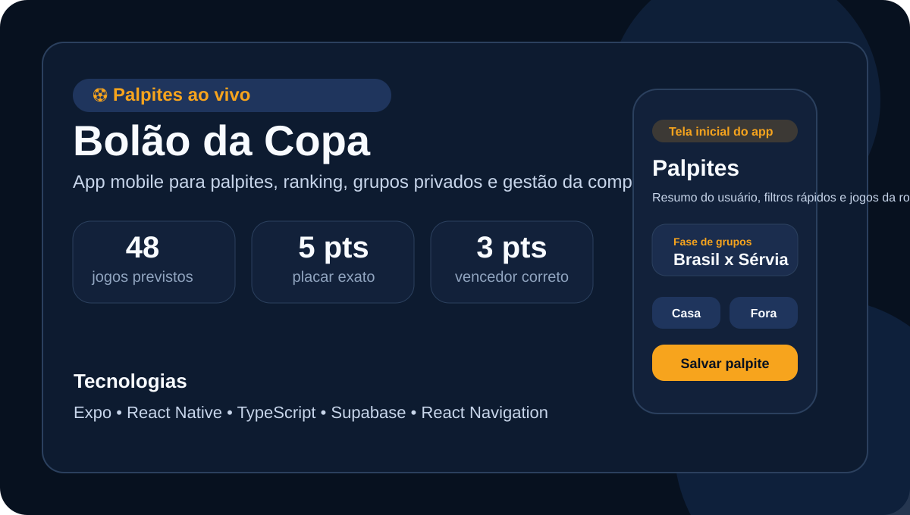

# ⚽ Bolão da Copa

Aplicativo mobile para gerenciamento de bolão da Copa do Mundo, permitindo cadastro de participantes, registro de palpites, ranking geral, grupos privados e controle de resultados oficiais.



## 📖 Sobre o projeto

O projeto foi desenvolvido como atividade final com foco em uma experiência mobile simples, moderna e funcional para organizar um bolão esportivo.

O sistema permite que participantes acompanhem partidas, façam palpites antes do início dos jogos, disputem pontuação com outros usuários e acompanhem rankings gerais ou privados.

## ✨ Funcionalidades

- Cadastro e login de participantes.
- Registro de palpites por partida.
- Escolha entre placar exato ou vencedor da partida.
- Bloqueio automático após o início do jogo.
- Ranking geral atualizado conforme os resultados oficiais.
- Grupos privados com código de convite.
- Perfil do participante.
- Área de resultados oficiais para usuários autorizados.

## 📱 Tela inicial

A imagem acima representa a tela inicial/apresentação do aplicativo no repositório.

## 🛠️ Tecnologias utilizadas

- Expo
- React Native
- TypeScript
- Supabase
- React Navigation

## 📂 Estrutura do projeto

```text
src/
├── components/
├── constants/
├── context/
├── lib/
├── navigation/
└── screens/

supabase/
└── schema.sql

docs/
├── ARCHITECTURE.md
├── CHECKLIST_ENTREGA.md
├── DIAGNOSTICO_REPOSITORIO.md
└── EMAIL_ENTREGA.md
```

## 🚀 Como executar

1. Instale as dependências:

```bash
npm install
```

2. Crie o arquivo de ambiente com base no exemplo:

```bash
cp .env.example .env
```

3. Preencha as variáveis:

- EXPO_PUBLIC_SUPABASE_URL
- EXPO_PUBLIC_SUPABASE_ANON_KEY

4. Execute o app:

```bash
npm run android
# ou
npm run ios
# ou
npm run web
```

## 👥 Integrantes

- Preencher nome dos integrantes da equipe

## 📝 Descrição breve do sistema

Sistema mobile de bolão da Copa do Mundo com autenticação, palpites por partida, ranking de participantes, grupos privados e gerenciamento de resultados oficiais.

## 🔗 Repositório

https://github.com/Jo0ji1/bolao-da-copa-desafio
